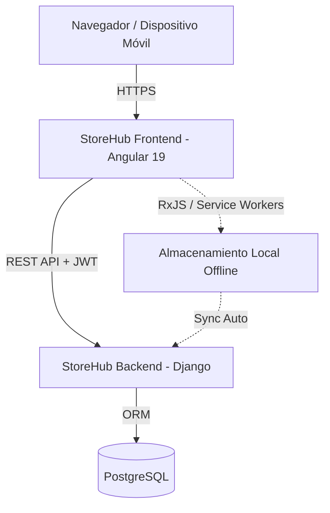

<div align="center">
  
  <h1>StoreHub (Frontend Cliente)</h1>
  <p><strong>Punto de Venta e Inventario Inteligente para Retail</strong></p>

---

**Repositorios del Proyecto:**

- [Frontend (Cliente Angular)](https://github.com/ulisestc/StoreHub) - *Estás aquí*
- [Backend (API Django)](https://github.com/ulisestc/StoreHub_Backend)

> **Proyecto destacado para la Feria de Proyectos 2026**
> Facultad de Ciencias de la Computación, Benemérita Universidad Autónoma de Puebla (BUAP).

---

## Contexto y Problemática

En el estado de Puebla, 7 de cada 10 personas ocupadas trabajan en la informalidad (más de 2.2 millones de personas). La mayoría de los pequeños negocios opera con registros manuales, generando errores de cobro, pérdidas de inventario no detectadas y opacidad financiera que impide el acceso a créditos formales.

## La Solución: StoreHub

**StoreHub** democratiza el acceso a herramientas digitales de gestión para asegurar que ningún negocio informal se quede fuera del crecimiento económico por no poder pagar software especializado. Construida como una plataforma web "mobile-first", integra:

- **StoreHub Local (Gratis para siempre):** La puerta de entrada a la digitalización. Punto de venta y control de inventario completo, sin cuotas ni letras chiquitas.
- **StoreHub Premium (Opcional):** Un agente impulsado por IA que ofrece recomendaciones estratégicas. La suscripción cubre solo el costo variable de las consultas.

Este proyecto se alinea directamente con el **Objetivo de Desarrollo Sostenible (ODS) 8: Trabajo Decente y Crecimiento Económico**.

---

## Funciones Principales

- **POS con Lectura de Código de Barras:** Registra ventas en segundos desde un escáner o incluso tu propio celular.
- **Inventario en Tiempo Real:** Alertas automáticas de bajo stock antes de que se acabe el producto.
- **Reportes y Dashboard de Ventas:** Visibilidad clara de qué se vende y cuánto se gana, sin hojas de cálculo.
- **StoreHub Copilot (IA):** Recomendaciones estratégicas basadas en tus propios datos de ventas e inventario.
- **Modo Offline:** Sigue vendiendo aunque falle el internet; todo se sincroniza al reconectar.
- **Notificaciones Automáticas:** Tickets y alertas de inventario enviados por correo sin intervención manual.

---

## Arquitectura del Sistema

Frontend construido en **Angular 19** utilizando componentes *standalone* y directivas modernas, asegurando un rendimiento superior y tiempos de carga óptimos. Conectado a un backend Django REST Framework mediante JWT.



---

## Instalación y Despliegue Local

### Requisitos Previos

- **Node.js**: `v18.x` o superior
- **Angular CLI**: `v19.2.17`

### Instrucciones

1. **Clonar el Repositorio**

   ```bash
   git clone https://github.com/ulisestc/StoreHub.git
   cd StoreHub
   ```
2. **Instalar Dependencias**

   ```bash
   npm install
   ```
3. **Variables de Entorno**
   Verifica la configuración hacia tu API local en `src/environments/environment.ts`:

   ```typescript
   export const environment = {
     production: false,
     apiUrl: 'http://localhost:8000/api'
   };
   ```
4. **Ejecutar en Desarrollo**

   ```bash
   npm run dev
   ```

   *Aplicación disponible en [http://localhost:4200](http://localhost:4200).*
5. **Compilación para Producción**

   ```bash
   npm run build
   ```

---

## Equipo Elaborador

- **Aaron Ulises Torres Corte** 
- **Alfredo Escudero Rivera**
- **Johan Yuri Martínez García**
- **Joselyn Ramírez Lima**

---

<div align="center">
  <sub>De lo manual a lo digital. ¡Crece tu negocio con StoreHub!</sub>
</div>
